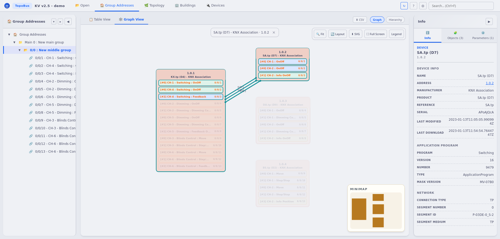

# TopoBus

<p align="center">
  
</p>

TopoBus ([ynn.github.io/topobus/](https://ynn.github.io/topobus/)) is a KNX project viewer for ETS `.knxproj` files. It helps you quickly see the topology and group addresses of a KNX installation in a graphical way.

<p align="center">
  
</p>


## What it does

- Visualize physical topology and group address views.
- Export the graph as SVG or PNG.

## Get the latest release

Open the GitHub Releases page for this repo, download the archive for your OS, unzip it, and run:

```bash
./topobus
# On Windows: topobus.exe
```

Then open `http://127.0.0.1:8080` and drop your `.knxproj` file.

## Online mode (GitHub Pages)

Open the GitHub Pages site for this repo and drop your `.knxproj` file in the page.

Important: the online mode runs fully in your browser (WASM). The file stays on your computer; nothing is executed or uploaded on the server.

If the online mode fails to load, try a modern browser and the local release.


## About

**This application is not affiliated with KNX Association. KNX is a registered trademark.**

**KNX Association owns KNX (the world's only open standard for Home and Building Control Systems) and owns the KNX Logo, a worldwide registered trademark.**

Main open source libraries: 

+ JointJS (MPL 2.0) — https://github.com/clientIO/joint, 
+ ELK (EPL 2.0) — (https://github.com/kieler/elkjs).

The Mocha and Latte themes are derived from https://catppuccin.com/.